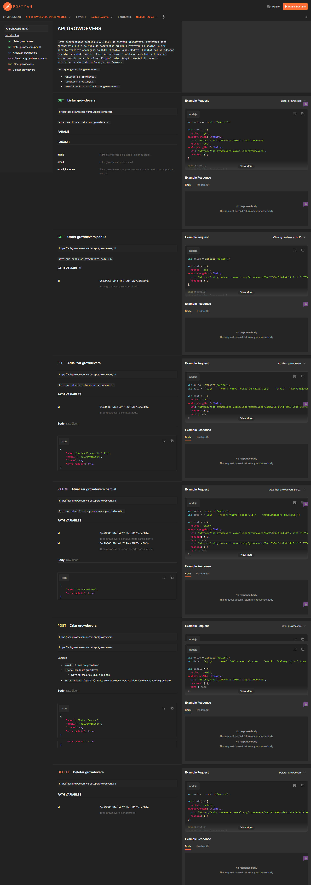

# 🚀 API Growdevers

[](https://nodejs.org/)
[](https://expressjs.com/)
[](#)
[](#)

API REST desenvolvida para gerenciamento de alunos (Growdevers),
permitindo operações completas de **CRUD (Create, Read, Update,
Delete)**, com filtros avançados e validações robustas via middlewares.

------------------------------------------------------------------------

## 🌐 Deploy & Documentação

A API está disponível publicamente:

-   🚀 **Produção (Vercel):**\
    https://api-growdevers.vercel.app/growdevers

-   ☁️ **Mirror (Render):**\
    https://api-growdevers-0ooy.onrender.com/growdevers

-   📖 **Documentação Interativa (Postman):**\
    https://documenter.getpostman.com/view/41098416/2sBXcHgy99


[](https://documenter.getpostman.com/view/41098416/2sBXcHgy99)

*Clique na imagem acima para abrir a documentação oficial.*

------------------------------------------------------------------------

## 📌 Visão Geral

Projeto estruturado com foco em:

-   Arquitetura limpa
-   Separação de responsabilidades
-   Validações consistentes
-   Padrão RESTful
-   Código escalável e de fácil manutenção

------------------------------------------------------------------------

## 🛠️ Stack Tecnológica

-   **Node.js**
-   **Express**
-   **CORS**
-   **Dotenv**
-   **UUID (randomUUID)**
-   **Nodemon**
-   **Prettier + prettier-plugin-jsdoc**
-   **ES Modules (import/export)**

------------------------------------------------------------------------

## 📁 Estrutura do Projeto

``` text
API-GROWDEVERS/
├── src/
│   ├── dados.js
│   ├── index.js
│   └── middlewares.js
├── .env
├── .env.example
├── .gitignore
├── .prettierrc
├── package.json
└── README.md
```

------------------------------------------------------------------------

## 🚀 Instalação Local

``` bash
# Clone o repositório
git clone https://github.com/emersonpessoa01/api-growdevers

# Acesse a pasta
cd api-growdevers

# Instale as dependências
npm install

# Execute em modo desenvolvimento
npm run dev
```

Configure o arquivo `.env` com base no `.env.example`.

------------------------------------------------------------------------

## 📌 Endpoints

**Base URL:**\
https://api-growdevers.vercel.app

### 🔎 Listar Growdevers

`GET /growdevers`

Filtros disponíveis:

-   `?nome=`
-   `?email=`
-   `?idade=`
-   `?email_includes=`

------------------------------------------------------------------------

### 🔍 Buscar por ID

`GET /growdevers/:id`

------------------------------------------------------------------------

### ➕ Criar Growdever

`POST /growdevers`

``` json
{
  "nome": "João Silva",
  "email": "joao@email.com",
  "idade": 22,
  "matriculado": true
}
```

------------------------------------------------------------------------

### ✏️ Atualização Total

`PUT /growdevers/:id`

### 🩹 Atualização Parcial

`PATCH /growdevers/:id`

### ❌ Remover

`DELETE /growdevers/:id`

------------------------------------------------------------------------

## 🛡️ Middlewares Implementados

### verificarCamposObrigatoriosMiddleware

-   Valida campos obrigatórios no POST e PUT
-   Garante idade mínima de 18 anos

### verificarExistenciaGrowdeverMiddleware

-   Verifica existência do ID
-   Injeta o objeto encontrado em `req.growdeverEncontrado`

### validateGrowdeverMiddleware

-   Trata lógica de filtros via Query Params

------------------------------------------------------------------------

## 👨‍💻 Autor

**Instrutora:**\
@leticialeal

**Desenvolvido por:**\
Emerson Pessoa

[](https://www.linkedin.com/)\
[](https://github.com/emersonpessoa01)

------------------------------------------------------------------------

🚀 Desenvolvedor em constante evolução.
