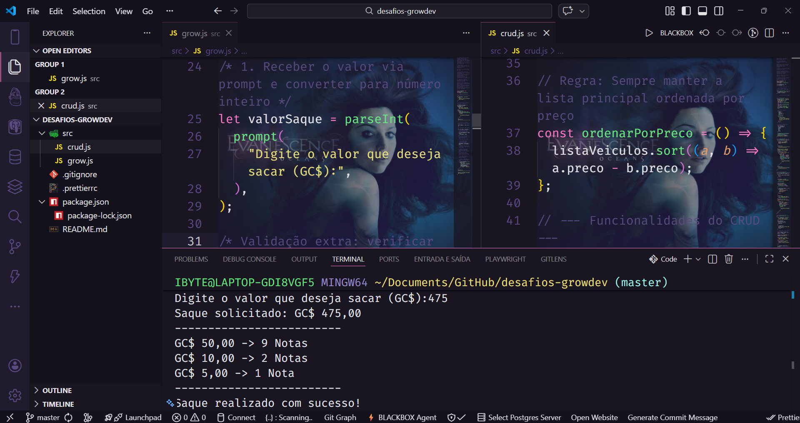
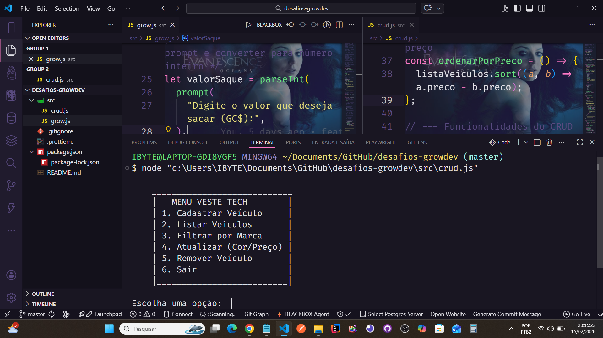

## 🔗 Links Úteis e Referências

<div style="display: flex; gap: 40px;">
  <a href="https://www.plataforma.growdev.com.br/course/codai-2-0" target="_blank" rel="noopener noreferrer nofollow">
    
  </a>

  <a href="https://growdev.com.br/vestetech/" target="_blank" rel="noopener noreferrer nofollow">
    
  </a>
</div>

## 🚀 Desafios Growdev: Lógica e CRUD com JavaScript

Este repositório contém as soluções desenvolvidas para os desafios técnicos propostos pela Growdev, focando em lógica de programação, manipulação de arrays e estruturação de aplicações modernas em Node.js (ESM).

---

### 🏦 1. Sistema de Caixa Eletrônico (src/grow.js)

#### Contextualização
Desenvolvimento do algoritmo de saque para caixas eletrônicos das Ilhas Growdev (Moeda Oficial: **GrowCoin GC$**). O objetivo é garantir a entrega do menor número de cédulas possível, priorizando as de maior valor.

#### Funcionalidades
- **Cédulas Disponíveis:** GC$ 50,00, GC$ 10,00, GC$ 5,00 e GC$ 1,00.
- **Lógica:** Implementação utilizando divisão inteira (`Math.floor`) e operador de resto (`%`) para otimização do saque.
- **Validação:** Verificação de entradas inválidas ou valores negativos.



---

### 🏎️ 2. CRUD de Veículos (src/crud.js)

#### Contextualização
Sistema interativo para gerenciamento de frotas com operações completas de Create, Read, Update e Delete via terminal, agora com suporte a armazenamento persistente.

#### Diferenciais Técnicos e "Fora da Caixa"
- **Persistência de Dados (JSON):** Uso do módulo nativo `fs` (File System) para salvar e carregar dados automaticamente de um arquivo `veiculos.json`, garantindo que os dados não sejam perdidos ao fechar o programa.
- **Validação Histórica:** Regra de negócio que impede o cadastro de anos anteriores a **1886** (ano da patente do primeiro automóvel moderno - Benz Patent-Motorwagen).
- **UX Otimizada:** Implementação de função de pausa para visualização de dados e laço `do...while` para permitir múltiplos cadastros em sequência.
- **Arquitetura Moderna:** Uso de **IIFE** (*Immediately Invoked Function Expression*) para inicialização automática do menu e proteção do escopo global.
- **Segurança de Dados:** Gerenciamento inteligente de IDs para evitar duplicidade após o recarregamento do arquivo JSON.



---

### 🛠️ Tecnologias e Configurações

O projeto utiliza **Node.js** com suporte nativo a módulos (ESM).

#### Dependências e Módulos
- `prompt-sync (^4.2.0)`: Captura de dados via terminal.
- `fs` (Node.js Native): Manipulação de sistema de arquivos para persistência.

#### Padronização
- **Prettier:** Código formatado para máxima legibilidade.
- **Conventional Commits:** Histórico de Git organizado e semântico.

---

### 📋 Como Executar

1. Certifique-se de ter o **Node.js** instalado.
2. No terminal, execute:

```bash
# Instalar dependências
npm install

# Executar o algoritmo de saque (Caixa Eletrônico)
npm run grow

# Executar o gerenciamento de veículos (CRUD)
npm run crud
```

### 📂 Estrutura do Projeto

```text
├── assets/           # Imagens e recursos visuais
├── src/              # Código fonte (Lógica Node.js)
│   ├── crud.js       # Sistema de gerenciamento de veículos
│   ├── grow.js       # Algoritmo de saque de GrowCoins
│   └── veiculos.json # Banco de dados local (Gerado automaticamente)
├── .gitignore        # Arquivos ignorados pelo Git
├── .prettierrc       # Configurações de formatação
├── package.json      # Dependências e scripts do projeto
└── README.md         # Documentação do projeto
```

### Instrutora: @leticialeal

✒️ Desenvolvido por Emerson Pessoa <br>
[Linkedin](https://www.linkedin.com/in/emersonpessoa01/) — Desenvolvedor em constante evolução 🚀
